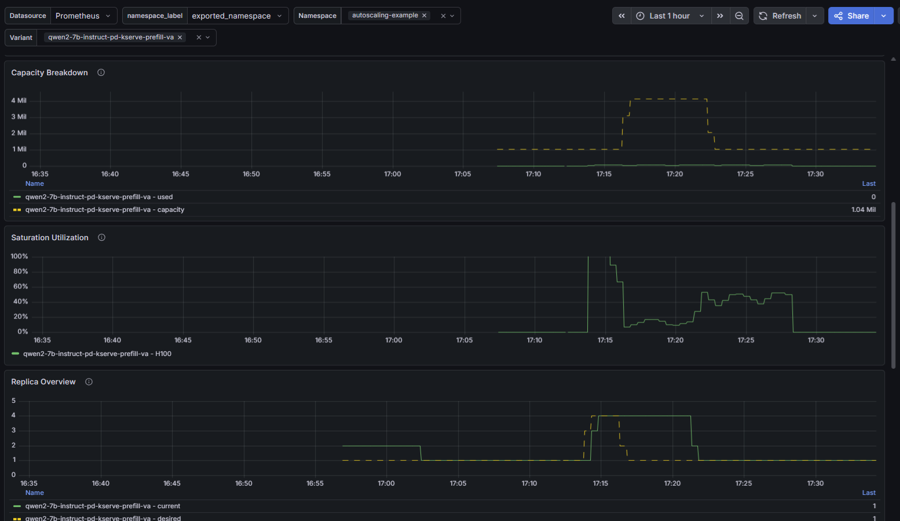
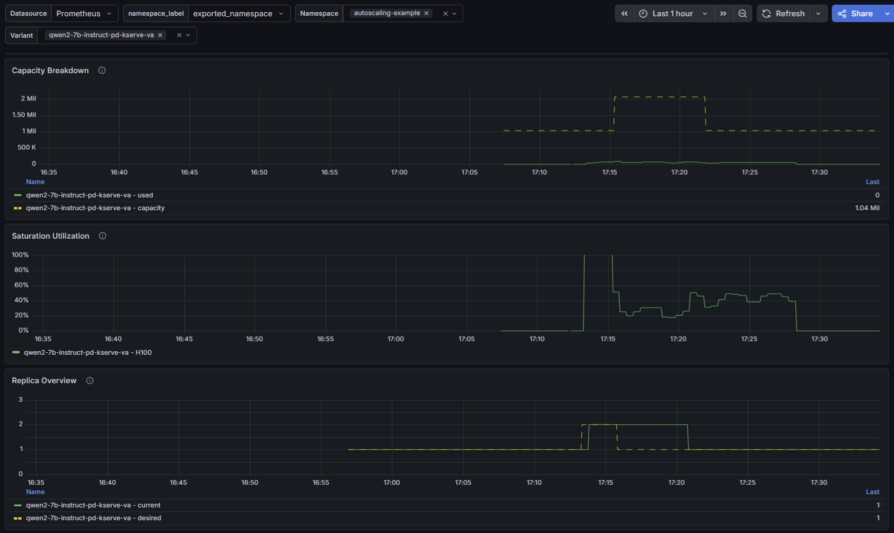
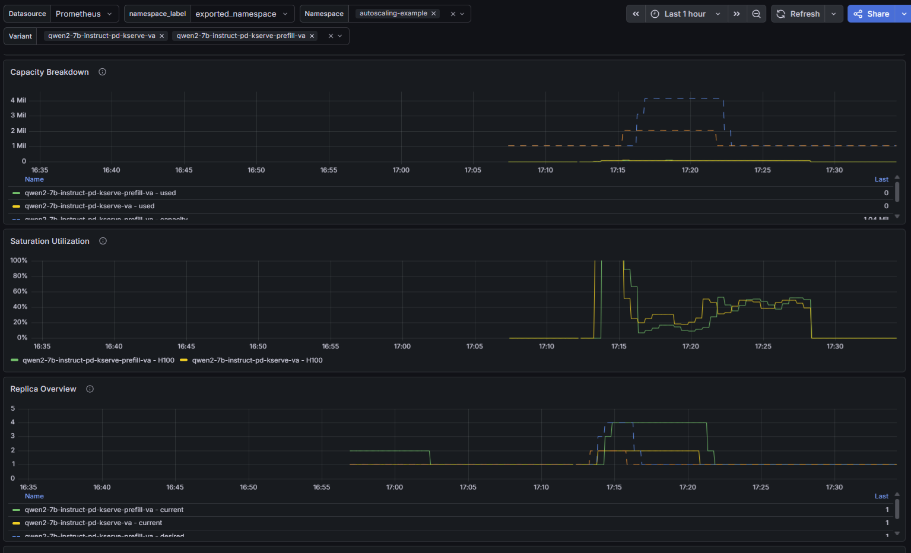
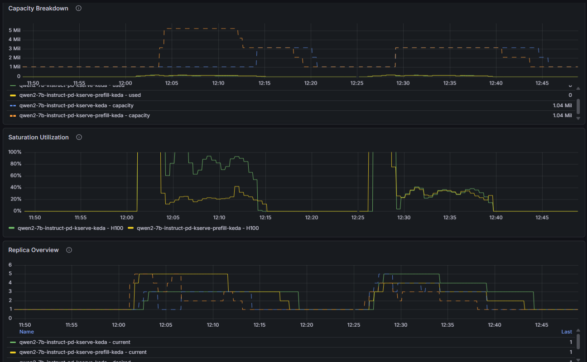

# Scaling P/D (Prefill/Decode)

[DOC TEAM: We should discuss how much of this doc we want to include]
This document shows an example of scaling an LLMInferenceService with P/D using WVA.

## Prerequisites
- WVA installed and operational. The example in this documented was tested with WVA 3.5-ea2 and newer versions.
- In this example, we configured WVA to use its V2 (Token-based capacity analyzer) by updating WVA manager configuration `analyzers` section. We also reduced `kvCacheThreshold`, `queueLengthThreshold`, `queueSpareTrigger` to force scaling up with less load - this is optional, you can expriment with different values or use the defaut values:
  ```
  $ oc get cm -n redhat-ods-applications workload-variant-autoscaler-saturation-scaling-config  -o yaml
  apiVersion: v1
  data:
    default: |
      kvCacheThreshold: 0.20
      queueLengthThreshold: 2
      kvSpareTrigger: 0.1
      queueSpareTrigger: 1
      analyzers:
      - name: saturation
  ```

## Create LLMInferenceService and Network Resources
You can apply the following YAML to create LLLMInferenceService and the network resources that it references:

```yaml
apiVersion: sriovnetwork.openshift.io/v1
kind: SriovNetworkNodePolicy
metadata:
  name: sriov-p2-policy
  namespace: openshift-sriov-network-operator
spec:
  deviceType: netdevice
  isRdma: true
  linkType: eth
  mtu: 9000
  nicSelector:
    deviceID: 101d
    rootDevices:
      - 0000:5c:00.0
      - 0000:5c:00.1
    pfNames:
      - p2
    vendor: 15b3
  nodeSelector:
    feature.node.kubernetes.io/pci-15b3.present: 'true'
    feature.node.kubernetes.io/pci-15b3.sriov.capable: 'true'
    feature.node.kubernetes.io/rdma.available: 'true'
    feature.node.kubernetes.io/rdma.capable: 'true'
  numVfs: 8
  priority: 98
  resourceName: p2rdma
---
apiVersion: sriovnetwork.openshift.io/v1
kind: SriovNetwork
metadata:
  name: roce-p2
  namespace: openshift-sriov-network-operator
spec:
  ipam: |-
    {
      "type": "whereabouts",
      "range": "10.0.132.0/24"
    }
  logLevel: info
  networkNamespace: 'autoscaling-example'
  resourceName: p2rdma
  spoofChk: "off"
  trust: "on"
  linkState: "enable"
---
apiVersion: serving.kserve.io/v1alpha2
kind: LLMInferenceService
metadata:
  name: qwen2-7b-instruct-pd
  namespace: autoscaling-example
  annotations:
    # RoCE network required for KV cache transfer via RDMA
    k8s.v1.cni.cncf.io/networks: roce-p2
    prometheus.io/scrape: "true"
    prometheus.io/port: "8000"
    prometheus.io/path: "/metrics"
    security.opendatahub.io/enable-auth: 'false'
spec:
  # Main/decode pool replica count
  model:
    uri: hf://Qwen/Qwen2.5-7B-Instruct
    name: Qwen/Qwen2.5-7B-Instruct
  labels:
    inference.optimization/acceleratorName: H100 # If using Accelerators, use the Name of your Accelerator
  scaling:
    minReplicas: 1
    maxReplicas: 5
    wva:
      keda:
        pollingInterval: 5
        cooldownPeriod: 30
  router:
    route: { }
    gateway: { }
    scheduler: { }
  template:
    # This affinity rule ensures that the KV transfer happens over the RDMA network because if the pods are placed
    # on the same node it will go over NVLink.
    #affinity:
    #  podAntiAffinity:
    #    preferredDuringSchedulingIgnoredDuringExecution:
    #    - weight: 100
    #      podAffinityTerm:
    #        labelSelector:
    #          matchExpressions:
    #          - key: app.kubernetes.io/component
    #            operator: In
    #            values:
    #            - llminferenceservice-workload-prefill
    #        topologyKey: kubernetes.io/hostname
    containers:
      - name: main
        image: quay.io/aipcc/rhaiis/cuda-ubi9:3.5.0-ea.2-1782155603
        env:
          # Enable RDMA for KV cache transfer
          - name: KSERVE_INFER_ROCE
            value: "true"
          # Pod IP for KV transfer side channel
          - name: VLLM_NIXL_SIDE_CHANNEL_HOST
            valueFrom:
              fieldRef:
                fieldPath: status.podIP
          # Enable KV cache transfer via NixlConnector (RDMA-based)
          - name: VLLM_ADDITIONAL_ARGS
            value: "--kv_transfer_config '{\"kv_connector\":\"NixlConnector\",\"kv_role\":\"kv_both\"}'"
          # UCX configuration for RDMA transport
          - name: UCX_PROTO_INFO
            value: "y"
          - name: UCX_TLS
            value: "rc,sm,self,cuda_copy,cuda_ipc"
        resources:
          limits:
            cpu: '4'
            memory: 32Gi
            nvidia.com/gpu: "1"
            rdma/roce_gdr: 1
          requests:
            cpu: '2'
            memory: 16Gi
            nvidia.com/gpu: "1"
            rdma/roce_gdr: 1
        livenessProbe:
          httpGet:
            path: /health
            port: 8000
            scheme: HTTPS
          initialDelaySeconds: 120
          periodSeconds: 30
          timeoutSeconds: 30
          failureThreshold: 5
  prefill:
    labels:
      inference.optimization/acceleratorName: H100 # If using Accelerators, use the Name of your Accelerator
    # Prefill pool replica count (higher for concurrent prefill requests)
    scaling:
      minReplicas: 1
      maxReplicas: 5
      wva:
        keda:
          pollingInterval: 5
          cooldownPeriod: 30
    template:
      # This affinity rule ensures that the KV transfer happens over the RDMA network because if the pods are placed
      # on the same node it will go over NVLink
      #affinity:
      #  podAntiAffinity:
      #    preferredDuringSchedulingIgnoredDuringExecution:
      #    - weight: 100
      #      podAffinityTerm:
      #        labelSelector:
      #          matchExpressions:
      #          - key: app.kubernetes.io/component
      #            operator: In
      #            values:
      #            - llminferenceservice-workload
      #        topologyKey: kubernetes.io/hostname
      containers:
        - name: main
          image: quay.io/aipcc/rhaiis/cuda-ubi9:3.5.0-ea.2-1782155603
          env:
            - name: KSERVE_INFER_ROCE
              value: "true"
            - name: VLLM_NIXL_SIDE_CHANNEL_HOST
              valueFrom:
                fieldRef:
                  fieldPath: status.podIP
            - name: VLLM_ADDITIONAL_ARGS
              value: "--kv_transfer_config '{\"kv_connector\":\"NixlConnector\",\"kv_role\":\"kv_both\"}'"
            - name: UCX_PROTO_INFO
              value: "y"
            - name: UCX_TLS
              value: "rc,sm,self,cuda_copy,cuda_ipc"
          resources:
            limits:
              cpu: '4'
              memory: 32Gi
              nvidia.com/gpu: "1"
              rdma/roce_gdr: 1
            requests:
              cpu: '2'
              memory: 16Gi
              nvidia.com/gpu: "1"
              rdma/roce_gdr: 1
          livenessProbe:
            httpGet:
              path: /health
              port: 8000
              scheme: HTTPS
            initialDelaySeconds: 120
            periodSeconds: 30
            timeoutSeconds: 30
            failureThreshold: 5

```

- One thing to note about the above LLMInferenceService resource:
  - The `labels` and `scaling` must be in both main and `prefill` sections.
  
## Verify LLMInferenceService
- Once created successfully and pods are up and running, check the LLMInference resource, its `READY` status should be `True`
  ```console
  $ oc get llmisvc -n autoscaling-example
  NAME       URL                                                                                                                             READY   REASON   AGE
  qwen2-7b-instruct-pd   https://openshift-ai-inference-openshift-default.openshift-ingress.svc.cluster.local/autoscaling-example/qwen2-7b-instruct-pd   True             66m
  ```

- Verify there should be 1 decode and 1 prefill pods:
  ```
  $ oc get po -n autoscaling-example
  NAME                                                              READY   STATUS    RESTARTS   AGE
  qwen2-7b-instruct-pd-kserve-6d75c669d9-wwqck                      2/2     Running   0          67m
  qwen2-7b-instruct-pd-kserve-prefill-778d9d59d4-6qp4b              1/1     Running   0          67m
  qwen2-7b-instruct-pd-kserve-router-scheduler-565697f9-t6qtc       1/1     Running   0          67m
  ```
- Verify the role label for decode and prefill pods. The label `llm-d.ai/role` should be `decode` and `prefill` for decode and prefill pods, respectively:

  ```
  $ oc get pods -n autoscaling-example qwen2-7b-instruct-pd-kserve-6d75c669d9-wwqck -L llm-d.ai/role
  NAME                                           READY   STATUS    RESTARTS   AGE   ROLE
  qwen2-7b-instruct-pd-kserve-6d75c669d9-wwqck   2/2     Running   0          78m   decode
  
  $ oc get pods -n autoscaling-example qwen2-7b-instruct-pd-kserve-prefill-778d9d59d4-6qp4b -L llm-d.ai/role
  NAME                                                   READY   STATUS    RESTARTS   AGE   ROLE
  qwen2-7b-instruct-pd-kserve-prefill-778d9d59d4-6qp4b   1/1     Running   0          78m   prefill
  ```

- Verify KEDA `scaledobject` created for prefill and decode deployments. This is the result of having the `scaling` sections in LLMInferenceService:
  ```
  $ oc get scaledobject -n autoscaling-example
  NAME                                       SCALETARGETKIND      SCALETARGETNAME                       MIN   MAX   READY   ACTIVE   FALLBACK   PAUSED   TRIGGERS     AUTHENTICATIONS            AGE
  qwen2-7b-instruct-pd-kserve-keda           apps/v1.Deployment   qwen2-7b-instruct-pd-kserve           1     5     True    True     False      False    prometheus   ai-inference-keda-thanos   68m
  qwen2-7b-instruct-pd-kserve-prefill-keda   apps/v1.Deployment   qwen2-7b-instruct-pd-kserve-prefill   1     5     True    True     False      False    prometheus   ai-inference-keda-thanos   68m
  ```

- For scaling, verify that WVA manager processes one model (`Qwen/Qwen2.5-7B-Instruct`) that has 2 variants - one for decode, one for prefill:
  ```console
  POD=$(oc get pod -l app.kubernetes.io/name=workload-variant-autoscaler -n redhat-ods-applications -o jsonpath='{.items[0].metadata.name}')

  oc logs -n redhat-ods-applications $POD | fgrep "Processing model"

  2026-07-10T00:33:20Z    INFO    saturation/engine.go:816        Processing model (V2)   {"modelID": "Qwen/Qwen2.5-7B-Instruct", "namespace": "autoscaling-example", "variantCount": 2, "groupKey": "Qwen/Qwen2.5-7B-Instruct|autoscaling-example"}

  ```

## Scaling
After running script to send requests to LLMInference service to cause scale up. WVA scaling can be observed as follows. Note: the script to send request can be found in WVA installation documentation. This section assumes that Grafana has been set up in the cluster and WVA operational dashboard has been imported to Grafana:
- The following screenshot shows scaling just for the prefill deployment by selecting `qwen2-7b-instruct-pd-kserve-prefill-va` in the `variant` pulldown menu:
  
  [](./images/pd-prefill.png)

- The following screenshot shows scaling just for the decode deployment by selecting `qwen2-7b-instruct-pd-kserve-va` in the `variant` pulldown menu:
  
    [](./images/pd-decode.png)

- The following screenshot shows scaling for prefill and decode deployments by selecting both in the `variant` pulldown menu:
  
    [](./images/pd-both.png)

## Comparing SCaling with P/D aware vs w/o PD/ aware
[DOC TEAM] This section documents the experiment and results. This section should not be in official doc.
### Setup
- H100 cluster with 6 GPUS available for the experiment.
- MaxReplicas is set to 10 (>6) to avoid hitting max replicas.
- WVA v0.8.0
- The load test script is not an official benchmark. It just starts a number of threads to send requests.
- P/D aware is supported by WVA V2 token-based capacity analyzer.
- P/D not-ware is achieved by manually update WVA code, commenting out code returning `llm-d.ai/role`
## Experiment
- The experiment first run for P/D not-aware, and then P/D aware.
- Here's the sequence of events:
  [](./images/pd-with-vs-without-aware.png)
  - 12:00 - 12:25: P/D not-aware
  - 12:25 - 12:45: P/D aware
  - 12:00 - 1 replica for P, 1 replica for D, 1 Mil tokens each.
  - 12:01 - In `Replica Overview`, P got signal to scale to 5
  - 12:02 - In `Replica Overview`, D got signal to scale to 3
  - 12:04 - In `Capacity Breakdown`, shows P has 5 replicas running (5 Mil tokens), while D still only has 1 replica running and 2 pending (recall max of 6 GPUs)
  - 12:14 - For remaining of the test, P runs with 5 replicas, D runs with 1 replicas. Hence, the `Saturation Utilization` shows the average load among P replicas is much lower than D for the duration of the test.
  - 12:25 - P/D ware starts
  - 12:25 - 12:27: `Replica Overview` shows P and D scale signals are fairly close to each other with P tops at 4, D at 5. As opposed to above where P tops at 5 first then D tops at 3.
  - 12:29 - `Capacity Breakdown` shows both has 3 replicas running (recall max of 6 GPUs). Having similar number of replicas in this experiment is the result of **alternate** scaling one variant and then the other. For remaining of the test, P runs with 3 replicas, D runs with 3 replicas. Hence, the `Saturation Utilization` shows the average load among P replicas is similar to D for the duration of the test.
## Conclusion
The experiment above shows when WVA is aware of P/D, it scales them **together** instead of independently which can result replicas and utilization imbalance as shown.